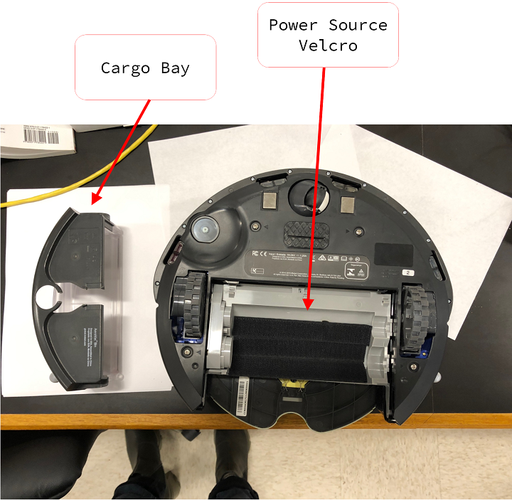

=====================================
Getting Started with the Raspberry Pi
=====================================

-------------------
Goals of this Guide
-------------------

#. Become familiar with the Raspberry Pi, equipment used with the Raspberry Pi,
   and the software used with the Raspberry Pi

#. Learn how to setup a headless Raspberry Pi i.e. without a monitor

#. Use SSH and other protocols to communicate with the Raspberry Pi

#. Remotely place programs and other types of files onto the Raspberry Pi

#. How to hook up the Raspberry Pi to the iRobot Create

#. Troubleshoot Errors

.. contents:: Table of Contents

---------
Materials
---------

| **A.** The Raspberry Pi (inside protective case)
| **B.** An SD card reader with USB attachment
| **C.** Micro SD card and adapter
| **D.** Power source

Raspberry Pi
============
Each Raspberry Pi has labels on its case that identify its number (1-3) and
its IP address for the lab network. The IP address should not change if the
SD card is replaced or swapped and as long as the router is not reset.

SD Card Reader
==============
While not required per se, a USB SD card Reader is important so any laptop or
even another Raspberry Pi can read/writer to an SD card. Backing up a Raspberry
Pi to another SD card is imperative.

SD Card
=======
The SD card is where the Raspberry Pi's OS lives. Once a fresh OS has been
flashed to a card and placed into the Raspberry Pi it should not be removed and
swapped between the other Pis.

Power Source + USB-C to micro USB cable
=======================================
Our lab makes use of beefy external phone chargers as our Pi's power source.
One side should be covered in velcro - this side is used to attach the battery
to the underside of the Create.

Serial Communications cable
===========================
The only other item required besides the Create itself is the Create serial
communications cable. Through this cable all commands are sent as well as all
sensor data is received.

.. image:: _static/images/raspberrypi/serial_comms_cable.png

-------------------------------
Installing the Operating System
-------------------------------

Step 1: Download and Install Necessary Software
===============================================

Raspberry Pi Imager
-------------------
| **Link**: https://www.raspberrypi.com/software/
| **Available For**: Windows / macOS / Ubuntu (x86)
| **Official Use Guide**: https://youtu.be/ntaXWS8Lk34

While there are plenty of options for image writing software, the official
Raspberry Pi Imager is cross-platform and is optimized for the Raspberry Pi.

PuTTY
-----
| **Link**: https://www.chiark.greenend.org.uk/~sgtatham/putty/latest.html
| **Available For**: Windows / Unix

PuTTY is a cross-platform SSH client suite that is incredibly useful for working
with the Raspberry Pi.

Step 2: Installing OS onto SD Card + Image Customization
========================================================

.. raw:: html

   <video width="720" height="480" controls muted autoplay>
      <source src="_static/videos/raspberry-pi/install_os.mp4" type="video/mp4">
   </video>

Video demonstration of the below steps

Connect the SD card reader to your computer and then insert the SD card you wish
to install the operating system on. If this card has been previously used and is
connected to a Windows computer then you may be bombarded with messages saying
to format the card; ignore these messages.

You can now launch the Raspberry Pi Imager. Under "Operating System" select
Raspberry Pi OS which should be the first option. Under "Storage" there should
be a single option such as "SDHC SCSI Disk Device" this is our SD card. Before
you write the OS onto the SD card go to the Advanced Menu (the little gear in
the lower right corner). We need to modify the setup of the Raspberry Pi so that
it automatically connects to the lab wifi network and has SSH configured.

In the Advanced Menu, make the following modifications:

#. Select "to always use" in the drop-down menu next to "Image customization
   options".

        - This saves the configuration options for next time
        - This step is not required but will save time rewriting options

#. Check off "Set hostname" and enter the name found on the label on the Pi's
   case such as "RPI-1".

        - The default hostname is raspberrypi.local and we can leave this but
          weird network things will happen when there are multiple
          raspberrypi.local's connected to the lab wifi.
        - The hostname is case sensitive so note "RPI-1" is the hostname and not
          "rpi-1"
        - The hostname shouldn't have any spaces in it. I make use of hyphens
          instead of spaces.

#. Check off "Enable SSH" and make sure "Use password authentication" is checked
   off.

#. Check off "Set username and password". Leave the username as "pi" and set the
   password to "qbes-lab".

        - The default password is not secure and if this raspberry pi were to be
          connected to the internet it would be a major security risk.

#. Check off "Configure wifi". The lab network's credentials are the following:

    **SSID**: SBG6900AC-B8296

    **Password**: c28e608474

#. Change the "Wifi country" to "US"

#. Click "SAVE"

#. Click "WRITE" and confirm you wish to erase the data on the card

Step 3: Further Configuration
=============================
While the Advanced Options menu has setup a lot of things for us we need to make
one more modification before we can boot up the Pi.

Raspberry Pi Imager should've ejected the SD card once the install was complete
so you should disconnect and reconnect the SD card into the SD card reader. If
you are using a Windows device, once again, ignore and exit out of any messages
saying to format the SD card. If you do happen to format the SD card you will
need to reinstall the operating System and redo step 2.

After reconnecting the SD card, go to the drive titled "boot" and open the file:
config.txt. This file contains various parameters loaded at boot time and serves
as the Raspberry Pi's BIOS.

    The config.txt file

    Navigate to the commented out line: hdmi_force_hotplug=1 and uncomment it
    like in this figure.

The hdmi_force_hotplug setting forces the Raspberry Pi to stream to the HDMI
port regardless if a monitor is connected to the Pi or not. This setting has
proved itself useful because for some reason without it, the Pi can have
problems booting as well as problems connecting to a monitor post-boot. Save
the change and you can now eject the SD card and connect it to the Raspberry Pi
and prepare to boot!

Step 4: Connecting the Raspberry Pi to the Create
=================================================
First flip the Create upside down. There should be platform screws that will
protect the markers attached to the Create while the Create is upside down.
You should find a velcro section on the Create's underbelly this is where the
Pi's power source will be connected. To access this part and place the power
source, remove the cargo bay from the Create like so:

Attach the power source to the velcro section and you should end up with the
following configuration. The power cable will be a snug fit.

.. image:: _static/images/raspberrypi/Create-pic-2.jpg

Flip the Create so it is back on its wheels. Reconnect the cargo bay and
thread the power cable through the hole on its top. You may now place the
raspberry pi to the velcro at the back of the Create like so. Note this
image is flipped and the text on the pi's case should be facing away from you.

.. image: _static/images/raspberrypi/Create-pic-3.jpg

Connect the Create's serial communications cable to the Create and one of the
USB ports found on the Raspberry Pi. Lastly, connect the power cable to the
micro-USB port found on the Raspberry Pi. The Create's light may go on indicating
it is ready for communication. The Raspberry Pi, however, will remain off until
we press the power button found on the power source. Once the power button is
pressed a red light inside the Pi will indicate it is receiving power while a green light
is flickering indicating it is booting.

.. image: _static/images/raspberrypi/Create-pic-4.jpg

Step 5: First Boot
==================
The first boot is the most error prone stage of setup. During the first boot,
all of our modifications to the configuration are loaded so we must be patient.
Allow up to 5 minutes before the Create has booted and connected to the lab
wifi network.

Step 6: Transfer Packages to the Raspberry Pi
=============================================
Load up a command prompt and travel to the directory just above atlantic-signatures.
From this directory enter the following. In the bracketed section, enter the Pi's
hostname (caps do not matter) so it looks similar to: pi@rpi3.local

.. code-block:: batch

    scp -rp atlantic-signatures pi@<Pi's hostname>:/home/pi/atlantic_signatures

Type yes to all the prompts and then enter the pi's password when prompted. You
should see a whole bunch of files being transferred.

NOTE: If you have used this particular Raspberry Pi before and it has since had
its operating system reinstalled then you may receive a scary message about hackers
and you will be denied from connecting to the Pi. An example message:

If you receive this message, you will have to modify the .ssh file that is mentioned.
I simply delete the file when this occurs:

Step 7: SSH Into the Raspberry Pi
=================================
Now that the Pi has all the files needed to run we can now connect to it using
PuTTY. PuTTY can be wonky with connecting to devices via hostname instead of IP
addresses so we will attempt to determine the Pi's IP address first.
The IP address found on the Pi's case should be considered a suggestion and at
this stage we should always determine its IP address from the host name provided
during setup.

Ensure we are connected to the lab wifi network on the host computer:

Load up a command prompt on the host and enter the following:

.. code-block:: batch

    ping /4 <enter the pi's hostname here>

The Raspberry pi will ping back with its IP address. Chances are this address
will be identical to the label found on the Pi's case.

Now that we know the IP address, enter it into a PuTTY window. You will be
prompted for the account to connect to: "pi" followed by the password: "qbes-lab"

Step 8: Setup Atlantic Signatures Environment
=============================================
Once the environment is setup on the Raspberry Pi, it will be ready to run tests. I have
written a setup script which automates making the virtual environment, installing dependencies,
and finally installing the atlantic_signatures python package. The files transferred to the
Pi during the previous step should be in the user directory (~) and thus should be visible
as a green directory titled "atlantic_signatures" if the user were to enter `ls`. From this
directory all you have to do is run the following:

.. code-block:: bash

    bash atlantic_signatures/setup-files/setup-pi.sh

Successful output of running the setup script:

You are now ready to run a test!