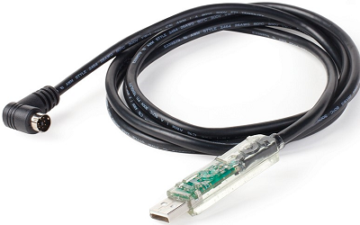

==================
Raspberry Pi Setup
==================

-------------------
Goals of this Guide
-------------------

#. Become familiar with the Raspberry Pi, equipment used with the Raspberry Pi,
   and the software used with the Raspberry Pi

#. Learn how to setup a headless Raspberry Pi i.e. without a monitor

#. Use SSH and other protocols to communicate with the Raspberry Pi

#. Remotely place programs and other types of files onto the Raspberry Pi

#. How to hook up the Raspberry Pi to the iRobot Create

#. Troubleshoot Errors

---------
Materials
---------

.. figure:: images/materials.jpg
  :width: 600

  **A.** The Raspberry Pi (inside protective case)
  **B.** An SD card reader with USB attachment
  **C.** Micro SD card and adapter
  **D.** Power source

**Raspberry Pi**

Each Raspberry Pi has labels on its case that identify its number (1-3) and
its IP address for the lab network. The IP address should not change if the
SD card is replaced or swapped and as long as the wifi router is not reset.

**SD Card Reader**

While not required per se, a USB SD card Reader is important so any laptop or
even another Raspberry Pi can read/write to an SD card.

**SD Card**

The SD card is where the Raspberry Pi's operating system and file system live.
Once a fresh OS has been flashed to a card and placed into the Raspberry Pi it
should not be removed and swapped between the other Pis.

**Power Source + USB-C to micro USB cable**

Our lab makes use of beefy external phone chargers as our Pi's power source.
One side should be covered in velcro - this side is used to attach the battery
to the underside of the Create.

**Serial Communications cable**

The only other item required besides the Create itself is the Create serial
communications cable. Through this cable all commands are sent as well as all
sensor data is received.

-----------------------------------------------
Installing the Operating System Onto an SD Card
-----------------------------------------------

Step 1: Download and Install Necessary Software
===============================================

You will need `Raspberry Pi Imager`_ on either the lab computer or a laptop to
install the Raspberry Pi operating system onto an SD card.

.. _Raspberry Pi Imager: https://www.raspberrypi.com/software

While there are plenty of options for image writing software, the official
Raspberry Pi Imager is cross-platform and is optimized for the Raspberry Pi.

Step 2: Installing OS onto SD Card + Image Customization
========================================================

Here is a video demonstration of the below steps.

.. warning::

    The video does not show one useful step, highlighted in a warning below!

.. video:: videos/raspberry-pi/install_os.mp4
    :width: 720
    :height: 480

Select the SD card you wish to install the operating system on. Connect it to a
computer with Raspberry Pi Imager installed using either a micro card adapter or
a USB reader. If this card has been previously used and is connected to a
Windows computer then you may be bombarded with messages saying to format the
card; ignore these messages, as Raspberry Pi Imager will take care of this for
you.

You can now launch Raspberry Pi Imager, and follow these steps:

    #. Under "Raspberry Pi Device", choose "Raspberry Pi 3". You can confirm
       this model number by looking at the label printed on the Pi's circuit
       board.

    #. Under "Operating System", choose "Raspberry Pi OS (64-bit)", which should
       be the first option.

    #. Under "Storage", there should be a single option labeled "SDXC Card" or
       "SDHC SCSI Disk Device". This is your SD card.

    #. Click "Next".

    #. When asked "Would you like to apply OS customisation settings?", choose
       "Edit Settings".

        #. Under the "General" tab, check "Set hostname" and set it to a name of
           the form "rpi1", "rpi2", or "rpi3". This name corresponds to the label
           on the Pi's case.

        #. Check "Set username and password". Set the username as "pi" and set
           the password. You will need this user password later.

        #. Check "Configure wireless LAN". Enter the lab wifi network's
           credentials. The SSID (network name) is: SBG6900AC-B8296. Set the
           wireless LAN country to "US".

        #. Check "Set locale settings". Keep the default time zone as
           "America/New_York". Set the keyboard layout to "us".

        #. Under the "Services" tab, check "Enable SSH". Make sure "Use password
           authentication" is checked.

           .. warning::

                As of September 2025, there is a glitch in the Raspberry Pi
                Imager's implementation of SSH service settings. Even if you
                select "Use password authentication", password authentication
                may be disabled if you have any "authorized_keys" listed in the
                second, unselected option. Depending on your system, one or more
                keys might be filled in here automatically. If this happens, you
                should *temporarily* select "Allow public-key authentication
                only", delete all keys, and then reselect "Use password
                authentication".

                If you fail to do this, you may not be able to log into the Pi
                later via SSH. You will see the error "Permission denied
                (publickey)" each time you try to log in. In this case, you can
                salvage the build by doing the following. Put the SD card into
                the Pi, then plug a keyboard, mouse, monitor, and finally power
                into the Pi to start it up. You must change one setting in the
                file ``/etc/ssh/sshd_config`` to fix the problem. In the Pi, use
                a terminal and open the file with ``sudo nano
                /etc/ssh/sshd_config``. Comment out the setting
                ``PasswordAuthentication no`` (line 57) by placing a ``#`` at
                the start of the line. Save and close the file. You must then
                restart the Pi for this change to take effect. After doing so,
                you should be able to log into the Pi via SSH with a password as
                intended.

        #. Click "SAVE" to finalize OS customization settings.

    #. Now you can click "YES" to apply these customization settings.

    #. Finally, you will be warned that all existing data on the card will be
       erased. Click "YES" to continue.

    #. After the OS is written to the SD card, the installation will be
       verified, and then finally the SD card will be unmounted and can be
       removed from the PC and inserted into the Pi.

Step 3: First Boot
==================

After inserting the newly imaged SD card into the Pi, plug the Pi into a power
source. Do not worry yet about mounting it on the Create or plugging in the data
cable. Right now, we just want to verify that the Pi is operating correctly.

The first boot is the most error prone stage of setup. During the first boot,
all of our modifications to the configuration are loaded so we must be patient.
Allow up to 5 minutes before the Create has booted and connected to the lab
wifi network. If you prefer, you can connect a monitor to the Pi to watch the
progress (this may help diagnose issues as well).

Step 4: Verify SSH Access
=========================

If everything worked as intended, the Pi should automatically connect to the lab
wifi after booting. Connect the lab computer to the lab wifi (SBG6900AC-B8296),
open the Windows Terminal, and verify the Pi is online using ping: ``ping <ip
address>``, where ``<ip address>`` is the IP address printed on the Pi's label.
You should confirmation of messages being sent to and received from the Pi.

Next, you need to clear any memory in the lab computer of prior operating
systems that existed at this IP address. Each new install of the Raspberry Pi OS
creates a new, unique SSH key "fingerprint" associated with that installation,
which the lab computer remembers once it successfully connects with that Pi. If
the fingerprint changes unexpectedly, even for legitimate reasons like
reflashing the SD card, the lab computer will assume that a hacker is attempting
a man-in-the-middle attack and prevent you from connecting to the Pi via SSH.

To clear the memory of an old SSH key fingerprint, use the following commands on
the lab computer: ``ssh-keygen -R <ip address>`` and ``ssh-keygen -R
<hostname>``, where again the ``<ip address>`` is printed on the Pi's label, and
the ``<hostname>`` was chosen during OS installation and should be of the form
"rpi1", "rpi2", or "rpi3".

Now, verify that SSH password authentication is working by attempting to connect
to the device: ``ssh pi@<ip address>``. The first time you do this, you should
be asked whether you want to accept the (new) SSH key fingerprint of the Pi.
Type "y" and press Enter to confirm. You should then be prompted for the user
password you entered during OS installation. (If instead you see "Permission
denied (publickey)", see the warning above.) If this works, the connection will
complete and you should see the terminal prompt change to something like
``pi@rpi1:~ $``. Type ``exit`` to log out of the Pi and "return" to the lab
computer.

Next, verify that a custom SSH configuration is working using: ``ssh
<hostname>``. This should work just like the last command, but is easier to
remember and shorter to type.

.. note::

    This shortened form of the SSH command works because of customizations made
    on the lab computer in the file ``C:\Users\TaylorLab\.ssh\config``. If you
    inspect this file, you should see the following:

    .. code-block:: powershell

        Host rpi1
            HostName 192.168.0.2
            User pi
        Host rpi2
            HostName 192.168.0.7
            User pi
        Host rpi3
            HostName 192.168.0.3
            User pi

Finally, we can teach the Pi to accept connections from the lab computer without
asking for a password each time. To do this, run the following commands from the
lab computer, remembering to replace ``<hostname>`` with "rpi1", "rpi2", or
"rpi3" in both commands:

.. code-block:: powershell

    scp C:\Users\TaylorLab\.ssh\id_ed25519.pub <hostname>:
    ssh <hostname> "mkdir -p .ssh && cat id_ed25519.pub >> .ssh/authorized_keys && rm id_ed25519.pub"

For each of these two commands, you will be asked to enter the user password.
After the second one, you should not need to enter the password again. Verify
this one last time with ``ssh <hostname>``. It should connect you automatically
without needing a password.

.. note::

    The prerequisite file ``C:\Users\TaylorLab\.ssh\id_ed25519.pub`` exists only
    because it was manually created on the lab computer. A new computer likely
    won't have this file already. If it's missing, you can create it using
    ``ssh-keygen``. This only ever needs to be done once per computer.

Step 5: Install Our Code on the Raspberry Pi
============================================

On the lab computer in Windows Terminal, change directories to the
atlantic-signatures project:

.. code-block:: powershell

    cd C:\Users\TaylorLab\Documents\atlantic-signatures

Install (or update) some very useful Git aliases onto the lab computer:

.. code-block:: powershell

    .\setup-files\setup-host.bat

Read the printout to learn about these new commands.

We're going to use one right now to finish setting up the Raspberry Pi:

.. code-block:: powershell

    git init-pi <hostname>

where ``<hostname>`` is "rpi1", "rpi2", or "rpi3". The ``git init-pi`` command
will transfer the atlantic-signatures Git repository to the Pi, and it will run
the ``setup-pi.sh`` script on the Pi, which does several things:

    #. Creates a Python virtual environment in ``~/atlantic-signatures/venv``.
    #. Installs Python package dependencies in the environment.
    #. Installs the atlantic-signatures code in the environment.
    #. Configures the environment to automatically activate each time you
       connect to the Pi via SSH.

Once this completes, you should be able to test things are working by
doing the following: SSH into the Pi using ``ssh <hostname>``, and then try
``atlantic_signatures --help``. Note the underscore in the last command (not a
hyphen!). If this works (it may take a few moments), you should see something
like this:

.. program-output:: atlantic_signatures --help
