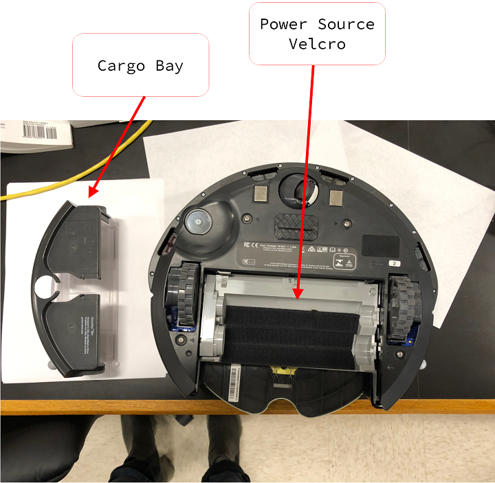
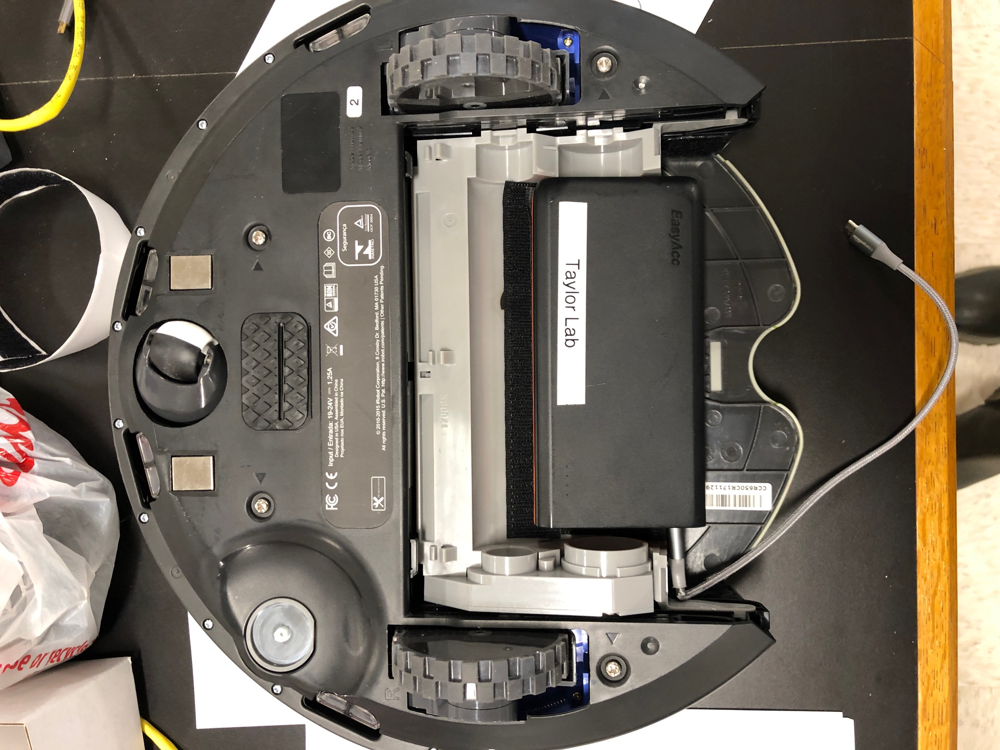
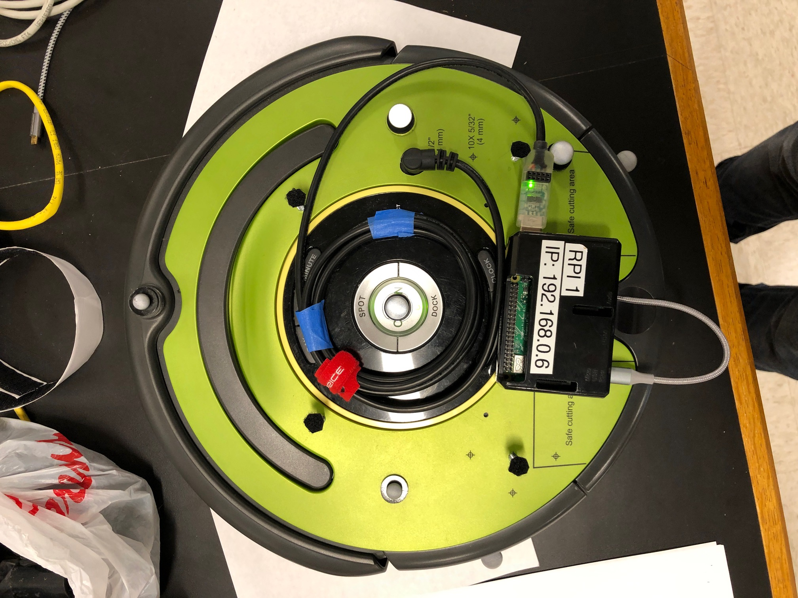

==============
Everyday Usage
==============

Note that in these instructions, "Host" refers to the lab desktop computer, and
"Client" refers to the Raspberry Pi in use.

-----
Setup
-----

#. Turn on the lab computer.
#. Plug in the camera hub.
#. Select a Roomba and note its number.
#. Select a Raspberry Pi and note its number.
#. Place the Pi on the Roomba, using the Velcro on the top, with USB ports
   pointing to the robot's right.
#. Locate the serial data cable and connect the Roomba and Pi.
#. Select a battery pack, mount it to the undercarriage of the Roomba, plug it
   into the Pi, and press the button on the battery pack (battery pack lights
   will come on).
#. Place the Roomba in the arena.

**Connecting the Raspberry Pi to the Create**

First flip the Create upside down. One of the Creates has platform screws that
will protect the markers attached to it while the Create is upside down. The
other two Creates do not have these, so be careful not to break off any markers.

You should find a velcro section on the Create's underbelly. This is where the
Pi's power source will be connected. To access this part and place the power
source, remove the cargo bay from the Create like so:

Attach the power source to the velcro section and you should end up with the
following configuration. The power cable will be a snug fit.

Flip the Create so it is back on its wheels. Reconnect the cargo bay and
thread the power cable through the hole on its top. Attach the Raspberry Pi to
the velcro on the top of the Create. Connect the serial communications cable to
the Create and one of the USB ports found on the Raspberry Pi. Lastly, connect
the power cable to the micro-USB port found on the Raspberry Pi. The Create's
light may go on indicating it is ready for communication. The Raspberry Pi,
however, will remain off until we press the power button found on the power
source. Once the power button is pressed, a red light *inside* the Pi will
indicate it is receiving power, and a green light flickering will indicate it is
booting.

------------
Lab Computer
------------

#. Manually connect the computer to the lab's wifi (SBG6900AC-B8296).
#. Open Vicon Tracker (green icon).
#. :ref:`Calibrate the cameras <calibration>`.
#. In Vicon Tracker's OBJECTS tab, select the Roomba in use and deselect all
   other objects.
#. In Vicon Tracker, change the 3D view to "3D ORTHOGONAL", and optionally zoom
   (right-click and drag).
#. Open two Windows Terminal windows side-by-side.

    #. Designate one terminal the host terminal. Run
       ``conda activate atlantic-signatures``, and then run
       ``cd Documents\atlantic-signatures``.
    #. Designate the other the client terminal. Run (for RPI-3) ``ssh rpi3`` to
       connect to the client.
    #. In each terminal, test that you can run ``atlantic_signatures --help``.
       Note the underscore in the command name.

#. Open GitKraken, and open the "atlantic-signatures" repository.

    #. NOTE: Because this repository is configured to push to the Raspberry Pi,
       GitKraken categorizes it as a private repo, which it does not support
       without purchasing a GitKraken Pro license. GitKraken will complain that
       the repo cannot be opened and will automatically close it. We can work
       around this by first running the following in the host terminal (for
       RPI-3): ``git remove-pi rpi3``. You should then be able to open the repo
       in GitKraken. Once the repo is open, we can add the Raspberry Pi back
       using ``git add-pi rpi3``. GitKraken checks whether a repo is private
       only when opening it, and so should allow us to keep it open until
       GitKraken restarts.

#. Ensure the host has the version of the "atlantic-signatures" repository you
   want to run checked out in GitKraken, and inspect any uncommitted changes.
   Any uncommitted changes that are not in the configuration file will run on
   the host only, and not on the client.
#. Ensure the client (Raspberry Pi) has the same version of the code by
   synchronizing the host and client using the following on the host (for
   RPI-3): ``git update-pi rpi3``. This command will irreversibly erase any
   modifications made to the code on the client!
#. Open Visual Studio Code.

---------------
Preparing a Run
---------------

#. Use VS Code to edit the configuration file (default ``demo.cfg``) to specify
   whichever parameters you want to use for the next run. Don't forget to save.
#. Optionally, simulate the run:

    #. Run the following in the host terminal: ``atlantic_signatures sim x0
       y0``, where ``x0`` and ``y0`` are initial coordinates in millimeters for
       the robot. If you wish to use initial coordinates corresponding to one of
       your goal locations (e.g., the last goal), look at your configuration
       file and convert those coordinates from meters to millimeters by
       multiplying by 1000. If you wish to use a configuration file other than
       the default, specify it with ``--file``.
    #. Locate the simulation output file on the host in
       ``Documents\atlantic-signatures\simulations`` and note the simulation
       number.
    #. Plot the simulation in the host terminal:
       ``atlantic_signatures plot simulations\Simulation-###.csv``, substituting
       the correct simulation number. You may include an optional parameter
       ``--n #``, where the number controls animation plot frequency (every n-th
       time point appears as an animation frame; default is 5).
    #. Inspect the static and animated plots to see if everything looks as
       expected. They will be located in
       ``Documents\atlantic-signatures\simulations`` next to the CSV file with
       matching names.

#. Run the robot:

    #. Prepare (but do not execute) commands in both the client and host
       terminals:

        #. Client: ``atlantic_signatures run``
        #. Host: ``atlantic_signatures run``, and if you wish to use a
           configuration file other than the default, specify it in the host
           terminal with ``--file``.

    #. In the client terminal, press Enter to run the command.
    #. Wait 4-5 seconds.
    #. In the host terminal, press Enter to run the command.
    #. After a few seconds, the robot should begin moving, and stop when either
       it reaches its final goal or it moves too far out of bounds to be seen by
       the cameras. You can optionally interrupt a run early by pressing ``Ctrl
       + c`` in either Terminal window.
    #. Locate the run output file on the host in
       ``Documents\atlantic-signatures\data`` and note the run number.
    #. Plot the run in the host terminal:
       ``atlantic_signatures plot data\Test-###.csv``, substituting the correct
       run number. You may include an optional parameter ``--n #``, where the
       number controls animation plot frequency (every n-th time point appears
       as an animation frame; default is 5).
    #. Inspect the static and animated plots to see if everything looks as
       expected. They will be located in ``Documents\atlantic-signatures\data``
       next to the CSV file with matching names.

--------
Teardown
--------

#. Shut down the lab computer.
#. Unplug the camera hub.
#. Remove the battery pack and put it on a USB charger.
#. Return the Pi and serial data cable to storage.
#. Return the Roomba to its docking station.

.. todo::

    Make Raspberry Pi and wifi passwords available somewhere secure.

.. todo::

    How-to on making Vicon objects, and backups of them.

.. todo::

    Section on how to make code changes and deploy them.

.. todo::

   How to push commits to GitHub (GH authentication)
