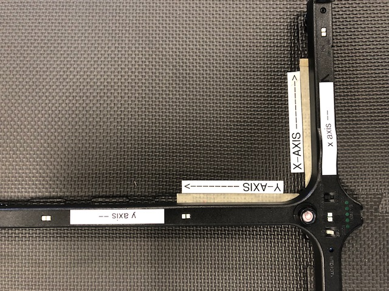

.. _vicon-calibration:

=========================
Calibrating Vicon Tracker
=========================

This guide presents a step-by-step calibration walkthrough, along with
troubleshooting tips.

-----------------------
Calibration Walkthrough
-----------------------

Now that we are familiar with the Vicon equipment and software, we can get the
cameras ready for data collection.

Setup Hardware and Software
===========================

Connect the Ethernet hub power cord to the "Surge + Battery" port at the back of
the UPS. If you do not hear the sound of the hub's fan or see the lights on the
cameras make sure the UPS itself is connected to an outlet.

Start up the lab computer and run "Vicon Tracker".

.. note::

    In the original version of these docs, created for Brian's lab at UNC, Luc
    wrote that Vicon Tracker should be run as administrator. In 2025 at CWRU,
    Jeff did not find this to be necessary.

Pre-Calibration Checklist
=========================

Before calibrating the cameras, do note the following about the lab itself:

    * Is the mat clear of debris?

        * There should be nothing but tape on the mat.

    * Are there new reflective surfaces in view of the cameras?

        * Reflections will always be your number 1 problem when calibrating

        * The lab's artificial lighting is not a concern thanks to the black
          rubber mat so you don't have to turn off the lights

    * Are there Roombas lying around?

        * Any Roomba with markers on top of it can mess up a calibration and
          should be sequestered away from the line sight of any camera, such as
          against the wall at the changing docks. Deselecting any tracked
          objects found in the Objects tab will also help but isn't necessary.

Create Camera Masks
===================

Even after taking these steps, reflections remain. A feature known as "camera
masking" allows you to purposefully obscure sections of a camera's vision. The
justification is that erroneous tracking data and bad calibrations are worse
than a camera blind spot. To create camera masks go to the Calibrate tab and
select "Start" under "Create Camera Masks". You should see bluish squares appear
and disappear in the field of view for each camera. After several seconds the
squares should've settled down and you can now select "Stop". If these squares
make up a large chunk of the view of one or more cameras then chances are there
are problematic reflections in the room that should be eliminated.

.. figure:: images/vicon-tracker-camera-masks.png
    :height: 400

Calibrate Cameras
=================

We are now ready to truly calibrate! Grab one the "magic wands" hanging on the
side of the lab cabinet. Now select Start under "Calibrate Cameras" in the
Calibrate tab. You should now turn on the magic wand lights and begin walking
around the periphery of the mat while simultaneously waving the wand at the
cameras. The ideal calibration method is to swing the wand by turning your wrist
while traveling in a circle around the perimeter of the mat area and also
spinning to face each camera for a second or two (think how the earth revolves
around the sun while also rotating around its own axis). As the calibration
progresses, the camera lights will blink faster and faster until it is a solid
green, indicating it is done. Some cameras will calibrate faster than others.
This is perfectly normal but ideally the faster a camera is blinking the less
time you should face it and give more time to the slower blinking or less
calibrated cameras. To visualize this, refer to the video below of a complete
calibration.

    A calibration magic wand.

Calibration Video Demonstration
===============================

.. video:: videos/edit2.mp4
    :width: 720
    :height: 480
    :muted:

Setting the Volume Origin
=========================

After calibration is complete, place the magic wand at the mat origin. The
positive y and positive x axes are denoted by tape on both the magic wand and
the mat. Line up both axes to the best of your abilities like in the below
picture:

    Unlike in the image, make sure the lights of the wand are still on when
    setting the volume origin!

Go back to the host computer, click "START" under "Set Volume Origin" followed
by another click to "SET ORIGIN". To check if the calibration worked, the
cameras should appear in a neat ring around the mat and will be numbered from 1
to 8 in order. If you are still in the camera view, select "3D Perspective" from
the drop-down menu titled "Camera" - this menu is just to the left of "View" in
the top left corner of the view pane.

    This calibration obviously did not go well, since the cameras are not
    positioned properly.

It is not unusual to have to recalibrate several times after a bad calibration.
Always look for ways to reduce reflections and you should time your walking
pace around the mat so that the last camera is calibrated just as you finish a
lap. Walking around too fast or too slow can both lead to a bad calibration.
(For Luc the sweet spot pace was between 1 and 1.5 minutes. Jeff usually took
longer!)

.. figure:: images/good-calibration.png
    :height: 400

    A successful calibration.

If your view pane looks like the above figure then you are ready to move on to
setting up the Raspberry Pi!

-----------------------
Troubleshooting Cameras
-----------------------

Sometimes one camera, or a few, will spontaneously disconnect. You will see
their corresponding icon in the System pane change from green to red, indicating
a data connection issue. In the perspecive view, a camera may change from green
to red, or may disappear from view entirely. As of 2025, it was unclear to Jeff
what caused these frequent problems. Here are some tips for dealing with this
issue.

There are two levels of loss of connection. In the less severe case, you can
issue a "Restart" command to the camera by right-clicking on it in the System
pane. In the more severe case, this won't be an option because the camera will
have gone entirely incommunicado; in this case, you need to cycle the power on
the camera by unplugging its ethernet cable from the hub. Wait ~30 seconds
before plugging it back in. If you have multiple cameras that need restarted,
try plugging them back in one at a time, with some time between each.

Occasionally, restarting cameras fixes the problem for the rest of the day. More
commonly, the same camera(s) will disconnect again and again in one day. In the
worst cases, it may be necessary to just keep a problematic camera disconnected
for the remainder of the day. There is enough redundancy in line of sight of the
cameras that you can lose several and you will still be able to track the
robots.

Looking at patterns across many days, Jeff observed some cameras are more likely
to misbehave than others, although there is a surprising amount of randomness to
it. He speculated (wildly!) that perhaps visual noise from reflections might
overload some cameras' point tracking capabilities, but he would readily admit
that he doesn't know whether that processing happens in the camera hardware (in
which case an underpowered CPU/GPU might theoretically fail to keep up with a
large number of points) or if this happens for all cameras at the desktop
computer (in which case it would be more surprising that a hardware
disconnection would result). Jeff once tried adjusting all of the cameras'
field-of-view, focus, and aperture opening, and he noticed a big improvement in
the cameras' connectivity for a while, suggesting to him that the recurring
connectivity problem has something to do with what the cameras actually see. But
this improved performance didn't last forever. Disconnections (and failed
calibrations) seemed to become more common when other lab personnel sharing the
space placed large objects with reflective surfaces on the perimeter of the mat.
One would think that masking should help with this, but it is conceivable that
masking happens at the desktop after the camera hardware has done point
discrimination, in which case masking would not help with this visual noise
"overload" problem -- but again these are Jeff's wild speculations!
