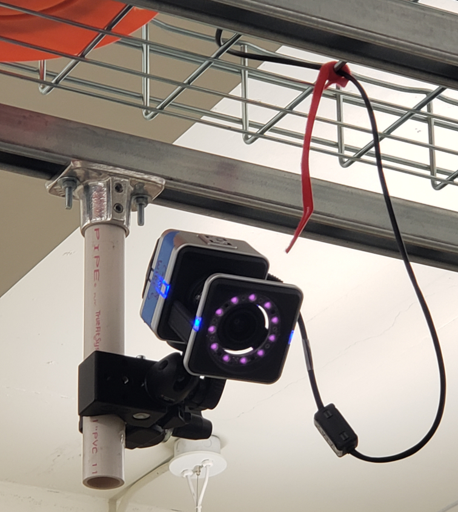
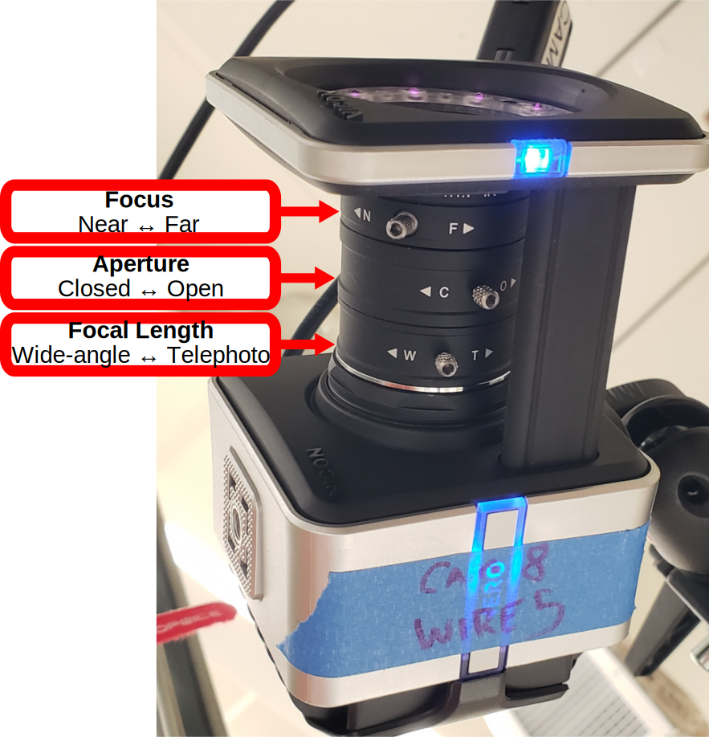

======================================
Manual Adjustment of the Vicon Cameras
======================================

Occasionally, it may be necessary to adjust the viewing angle, focus, and
field-of-view of the cameras to ensure that they effectively capture the entire
test area while also avoiding potential reflections outside it. This guide
provides advice on how to adjust the manual settings of the cameras.

In Vicon Tracker, you can Alt + Left-Click and drag the mouse to select the
tracking markers detected in the test area. Once selected, lines are drawn from
each marker to each camera that sees it. This allows you to visualize precisely
which cameras are contributing to the localization of markers in real time.

If you notice that some cameras are rarely contributing data to the localization
of tracking markers when you think they probably should (the camera is online
and pointed in the right direction), this might be because the focus, aperture,
and/or focal length (field-of-view) was poorly set on those cameras.

-------------------
Theory of Operation
-------------------

The ideal camera configuration has the following properties:

    - **Maximized field of view:** Each camera should capture as much of the
      test area as possible *without* also capturing reflective surfaces outside
      it. This ensures multiple cameras see each marker at all times, improving
      tracking accuracy. It also ensures that spurious reflections from outside
      the test area do not interfere. The odd-numbered cameras (corners of the
      mat) are most prone to seeing outside the intended test area, so it is
      advisable to narrow the field of view of these cameras.

    - **Maximized depth of field:** As much of each camera's viewable area
      should be in focus as possible. This ensures that wherever the robot goes,
      as long as it is within the camera's field of view, that camera can
      continue to localize tracking markers with accuracy. However, since every
      lens has a limited depth of field, very far or very near objects may not
      be perfectly in focus. The goal is to set the focus near the middle
      ground, so that both foreground and background are not too out of focus.

    - **Optimized exposure:** Each camera's aperture should be open enough to
      clearly detect a tracking marker, but not so open that the camera sensor
      is saturated by a marker's reflected light. When the sensor is saturated,
      it diminishes the tracking algorithm's certainty of what it is looking at
      and precisely where the marker's center is. The software evaluates the
      circularity of the objects it sees, recognizing tracking markers as
      near-perfect circles. The center of the circle can be identified with
      greater precision if the center of the marker is brighter than its
      periphery. When too much light is let in, the entire circle will be
      equally bright (saturated).

-----------------------------
Camera Adjustment Walkthrough
-----------------------------

    The Vicon Vero cameras are mounted to cable trays attached to the ceiling.
    (Note that the purple strobe LEDs visible in this photo emit infrared light
    and are invisible to the naked eye!)

    The Vicon Vero has three adjustable rings. The **Focus** ring is labeled
    with "N" and "F" for Near and Far. The **Aperture** ring is labeled with "C"
    and "O" for Closed and Open. The **Focal Length** ring is labeled with "W"
    and "T" for Wide-angle and Telephoto (Tight-angle). Each ring has a set
    screw that can be tightened to prevent accidental movement of the ring. When
    a set screw is difficult to tighten because it lines up with the support
    frame of the camera, you can unscrew the set screw and locate another hole
    for it on the same ring that is easier to work with.

Here are recommended steps for improving manual camera settings. Keep the theory
of operation principles outlined above in mind as you follow these steps:

    #. Place test markers around the arena, near the origin and the corners. You
       can use the calibration wands as well to help with getting oriented, but
       don't follow this guide to focus the cameras on LEDs, as this may not
       guarantee good performance on reflective tracking markers.
    #. In Vicon Tracker, set the view to "CAMERA".
    #. Using the green buttons at the top of the view, disable the display of
       centroids (which can be distracting), and enable the display of grayscale
       blobs.
    #. Use Windows + P to change the computer monitor mode to Duplicate, so that
       Vicon Tracker is visible on both monitors, and then turn one monitor to
       face the camera(s) you will be working on.
    #. Select the camera you want to adjust from the System tab.
    #. Change the camera's Grayscale Mode from "Auto" to "All" (removes
       thresholding, allowing you to see dim markers better).

       You should now be looking at something like this:

       .. figure:: images/vicon-camera-blobs.png
        :height: 400

       Note that if you are struggling to locate any grayscale blobs, this might
       be because the adjustable camera rings need significant adjustment. You
       may need to experiment and iterate. The bright LEDs of the calibration
       wand are a useful sanity check.

    #. Using the stepladder, adjust the camera's pitch, yaw, and roll as desired
       using the camera mount. *Take great care that the expensive camera does
       not drop to the ground!*
    #. Zoom in (right-click and drag) on tracking markers placed near the
       desired middle ground (the middle distance that you want this camera to
       focus on). For the even-numbered cameras (sides of the mat), the origin
       is recommended as the focus point. For the odd-numbered cameras (corners
       of the mat), markers placed in the center of each quadrant might be
       better focus points. Zoom until these markers fill most of the screen.
    #. Using the stepladder, adjust the camera's three rings (see photo above):
        #. Initially, make sure the aperture is turned all the way open (O), not
           closed (C), to let in maximum light.
        #. Start with the focal length on wide-angle (W), not
           telephoto/tight-angle (T).
        #. Adjust the focus (N/F), along with the focal length (W/T), to get the
           sharpest and roundest grayscale blobs possible. Jeff generally had
           the focal length almost 100% wide, but might have backed it down
           some, especially for odd-numbered (corner) cameras, since he did not
           want corner cameras to capture activity outside the test mat.
        #. Slightly close the aperture (O/C) to make sure the sensors are not
           quite fully saturated. Ideally the centers of the tracking markers
           should appear as off-white, not fully white, and you will see a
           gradient of gray across the tracking marker out to its edge.
    #. Zoom out again (right-click and drag) in Tracker to see the full view of
       the camera, and use a calibration wand to evaluate where the edges are of
       the view.
    #. You may need to repeat adjustments to get everything right. Keep in mind
       the theory of operation principles: **Ultimately, you want (1) the field
       of view to be as wide as possible without including reflective surfaces
       outside the test area, (2) tracking markers at the camera's chosen middle
       ground to be in sharp focus, and (3) the amount of light entering the
       camera from those focused markers to not quite saturate the sensor.**
    #. Once you are satisfied, return the camera's Grayscale Mode to "Auto".
       *The Vicon documentation suggests this is important.*
    #. Repeat these steps with other cameras.
    #. Finally, re-enable the display of centroids when done (and double check
       that Grayscale Mode is set to "Auto" for each camera!).
