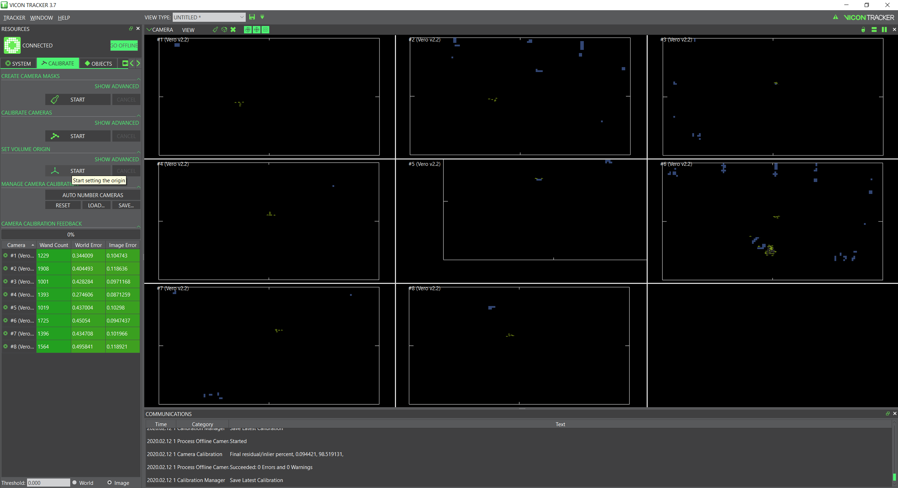
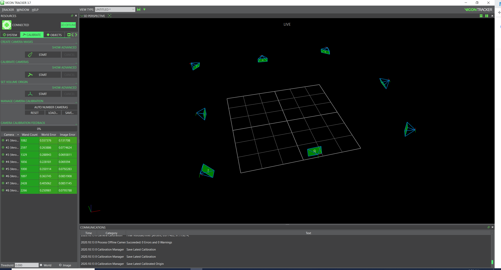

==========================
Getting Started with Vicon
==========================

This guide will first introduce the equipment, methods, and other notable information.
Following the introduction, this guide presents the step-by-step checklist I go through
as soon as I walk in to the lab.

------------
Introduction
------------

Before we jump to the how-to part of this guide it is prudent to know the
terminology and equipment. If you wish to learn more about Vicon cameras and their
tracking software go to the corresponding section of the Vicon documentation
website: https://docs.vicon.com/

.. contents::
    :local:

Lab Layout
==========

    Blue arrows designate ethernet connections while black arrows designate
    power connections

Hardware
========

As seen in the lab layout diagram, the four main components of the Vicon System
are the cameras, an ethernet hub, a UPS (Uninterruptible Power Supply), and the
host computer. Through the ethernet hub, camera data is relayed to the Host
computer. The ethernet hub has a second purpose and that is to power the cameras
(power over ethernet - POE). The UPS provides power during momentary power
failures so that a several second or even several minute "blackout" will not
affect the cameras.

When the user wishes to start up the cameras all they need to do is plug the
power cable of the ethernet hub directly into the UPS. Connect the hub into the
port at the back of the UPS titled "Surge + Battery" like the following:

.. image:: images/ups.svg

Once connected you will hear a fan rev up and see the lights on the cameras
turn on.

Next, the user should log on to their UNC account on the Host computer. Type in
"Vicon" into the Windows search. Vicon Tracker 3.7.0 x64 (or some later version)
should appear. If Vicon Tracker does not appear for some reason do not hesitate
to contact Brian.

Once loaded, Vicon Tracker will welcome you with the "resources pane" on the
left side of the screen and a much larger camera perspective pane on the right.
Don't worry if the cameras are red instead of green - that's why we calibrate!
Please familiarize yourself with the layout before moving on.

There are four tabs in the resources pane: System, Calibrate, Objects, and
Recording. The first three are the only ones of importance since we do not take
any recordings using Vicon. The System tab contains settings that you will never
change but a problem camera can be rebooted from here by right clicking the
camera and selecting "reboot". Note: rebooting a camera will necessitate a new
calibration. The Calibrate tab is fairly self explanatory and finally the Objects
tab allows you to select and deselect objects that the cameras will track. The
Create's typically will have an object name like 'Create2' or 'Create2-1'.

.. table:: The three main tabs you will be bouncing between
    :align: center

    +----------------------------------------------------+------------------------------------------------------+------------------------------------------------------+
    | .. image:: images/vicon-tracker-system-tab.png     | .. image:: images/vicon-tracker-calibrate-tab.png    | .. image:: images/vicon-tracker-objects-tab.png      |
    |   :width: 240px                                    |   :width: 240px                                      |   :width: 240px                                      |
    |   :height: 480px                                   |   :height: 480px                                     |   :height: 480px                                     |
    |   :align: left                                     |   :align: center                                     |   :align: right                                      |
    +----------------------------------------------------+------------------------------------------------------+------------------------------------------------------+

-----------------------
Calibration Walkthrough
-----------------------

Now that we are familiar with the Vicon equipment and software we can now get the cameras
ready for data collection.

.. contents::
    :local:

Setup Hardware and Software
===========================

Connect the Ethernet hub power cord to the "Surge + Battery" port at the back of the UPS. If you
do not hear the sound of the hub's fan or see the lights on the cameras make sure the UPS itself
is connected to an outlet.

Log on to your UNC account and run "Vicon Tracker" as an administrator.

Pre Calibration Checklist
=========================

Before calibrating the cameras. Do note the following about the lab itself:

    * Is the mat clear of debris?

        * There should be nothing but tape on the mat.

    * Is the current weather cloudy or sunny? If sunny, are the window blinds open?

        * Reflections will always be your number 1 problem when calibrating so
          you should opt to close the blinds on all but the most cloudy of days

        * The lab's artificial lighting is not a concern thanks to the black
          rubber mat so you don't have to turn off the lights

    * Are there Roombas lying around?

        * Any Roomba with markers on top of it can mess up a calibration and
          should be sequestered. The Roombas can be placed in one of the drawers
          found in the lab island or simply move it so it is off the mat and
          away from the line sight of any camera. Deselecting any tracked objects
          found in the Objects tab will also help but isn't necessary.

Create Camera Masks
===================

Even after closing the blinds reflections remain. A feature known as "camera masking"
allows you to purposefully obscure sections of a camera's vision. The
justification is that erroneous tracking data and bad calibrations are worse
than a camera blind spot. To create camera masks go to the calibrate tab and
select "Start" under "Create Camera Masks". You should see bluish squares appear
and disappear in the field of view for each camera. After several seconds the
squares should've settled down and you can now select "stop". If these squares
make up a large chunk of a camera(s) view then chances are the blinds are open
and you will need to close them.

Calibrate Cameras
=================

We are now ready to truly calibrate! Grab one the "magic wands" found on the lab
island. Now select Start under "Calibrate Cameras" in the Calibrate tab. You
should now turn on the magic wand lights and begin walking around the periphery
of the mat while simultaneously waving the wand at the cameras. The ideal
calibration method is to swing the wand by turning your wrist while traveling in
a circle around the perimeter of the mat area and also spinning to face each
camera for a second or two (think how the earth revolves around the sun while
also rotating around its own axis). As the calibration progresses, the camera
lights will blink faster and faster until it is a solid green indicating it is
done. Some cameras will calibrate faster than others, this is perfectly normal
but ideally the faster a camera is blinking the less time you should face it and
give more time to the slower blinking or less calibrated cameras. To visualize
this, refer to the video below of a complete calibration.

.. figure:: images/vicon-magic-wand.png

    A calibration magic wand.

Calibration Video Demonstration
===============================

.. video:: videos/edit2.mp4
    :width: 720
    :height: 480

Setting the Volume Origin
=========================

After calibration is complete, place the magic wand at the mat origin. The
positive y and positive x axes are denoted by tape on both the magic wand and
the mat. Line up both axes to the best of your abilities like in the below
picture:

.. figure:: images/vicon-magic-wand-origin.jpg

    Unlike in the image, make sure the lights of the wand are still on.

Go back to the host computer, click "START" under "Set Volume Origin" followed
by another click to "SET ORIGIN". To check if the calibration worked, the
cameras should appear in a neat ring around the mat and will be numbered from 1
to 8 in order. If you are still in the camera view, select "3D Perspective" from
the drop-down menu titled "Camera" - this menu is just to the left of "View" in
the top left corner of the view pane.

.. figure:: images/vicon-tracker-bad-calibration.png

    An obviously bad calibration.

It is not unusual to have to recalibrate several times after a bad calibration.
Always look for ways to reduce reflections and you should time your walking
pace around the mat so that the last camera is calibrated just as you finish a
lap. walking around too fast or too slow can both lead to a bad calibration, for
me the sweet spot pace is between 1 and 1.5 minutes.

    A successful calibration.

If your view pane looks like the above figure then you are ready to move on to setting
up the Raspberry Pi!
